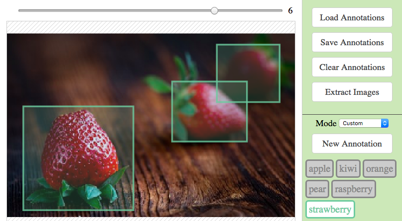

# Box It

*Box It* is a web app for annotating images. This version includes license
plate specific features.

## Supported Browsers

This app takes advantage of unusual browser features, so support may
spotty.

Currently tested on Chrome 69.0 and Firefox 62.0. Chrome works best.

## Running Box It

Clone this project and launch with a web server (such as
[caddy](https://caddyserver.com/)), or simply open 
[https://bigmlcom.github.io/boxit/](https://bigmlcom.github.io/boxit/).

## Examples

The `examples` and `examples/images` directory contains example
annotation files and example images, respectively.

## Usage

### Selecting Images

The `Select Images` button allows a directory of images to be loaded
for annotation. While there may be dialog confirming the upload of the
images to the server, the images are not shared with the server. The
selected files are only accessed by the browser.

### Navigating and Annotating

The right and left arrow keys will step through the selected
images. Alternatively the top slider can be used to jump to an image.

The view window's zoom level may be controlled with the mouse wheel,
or double-clicking to zoom. The view window also supports panning
through a click and drag.

After selecting an annotation mode and class (see below), an region
may be annotated by simply clicking once to start an annotation box
and a second time to finalize the box. A box can be deleted with
backspace. If there are multiple boxes, they will be removed in the
order they were created.

### Annotation Modes

This version of *Box It* has two annotation modes.

First is the `custom` mode, in which a user creates their own set of
annotation classes. Each annotation class may be selected by either
clicking on the corresponding button or by using keys 0-9. The number
keys will select the annotations according the order they appear in
the sidebar.

Second is the `license plate` mode. This mode comes with alpha-numeric
annotations predefined. Hotkeys are simply the corresponding keys on
the keyboard. Note that `0` and `O` are both interpreted as `0`.

When loading an annotation file, the mode will be autodetected.

### Clearing Annotations

Annotations are cached with the browser, so closing the browser will
not cause your work to be lost. However, the `Clear Annotations`
button will delete the cached annotations.

### Saving and Loading Annotations

The `Save Annotations` button will save the annotations in a JSON
format. This will create an `annotations.json` file in your browser's
default downloads directory.

Similarly, the `Load Annotations` button will load annotations from a
JSON file. The loaded annotations will override any existing or cached
annotations in the browser.

### Extracting Images

The `Extract Images` button will crop and save each boxed region as a
seperate file in your browser's default download directory. This is
especially useful for annotating heirarchial objects that will be
modeled seperately.

### License

Copyright (C) 2019 BigML Inc.

Distributed under the Apache License, Version 2.0.
